# Firebase

### Firebase project
We create a new project from the firebase console:

[https://console.firebase.google.com/](https://console.firebase.google.com/)

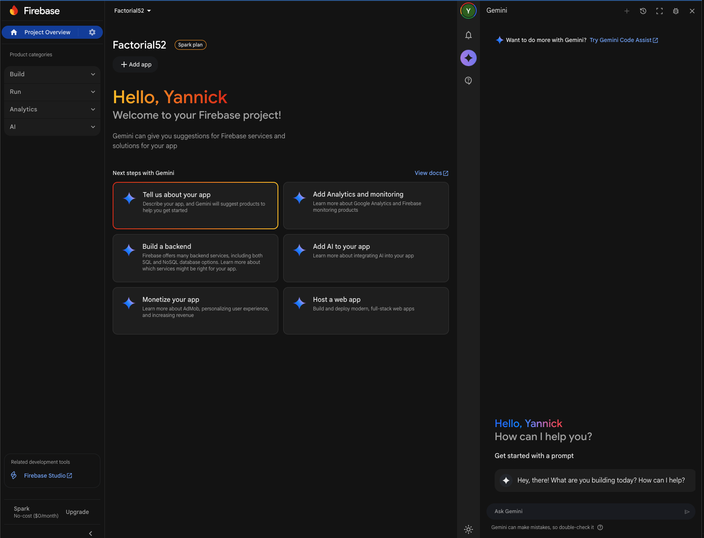


then we can use the cli to list it:

```
firebase projects:list
```
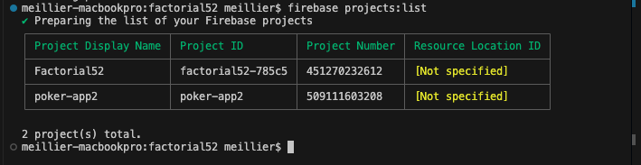

### npm run build:

```
npm run build
```
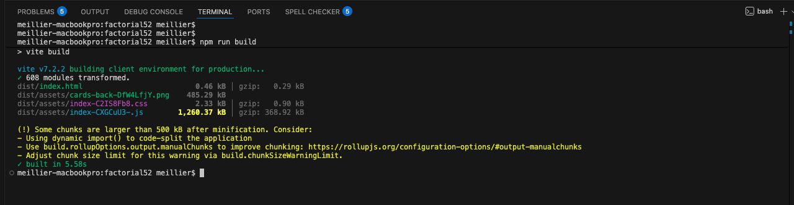

**The file in `dist/index.html` is your actual application.** You just created it when you ran `npm run build`

### Firebase project Setup: 
- creates firebase.json (configuration info)
- .firebaserc (project information)
```
firebase init hosting
```

--> use an existing project
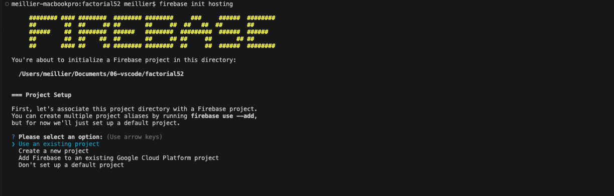


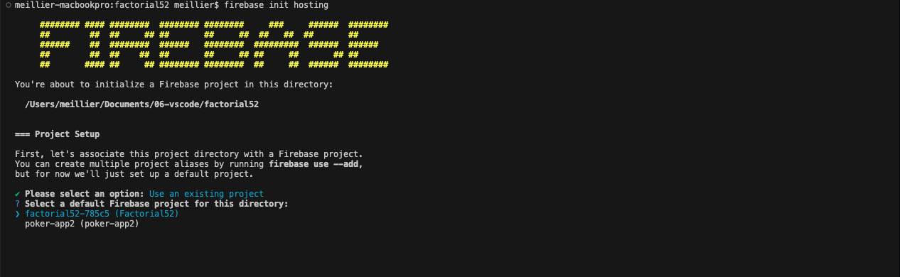

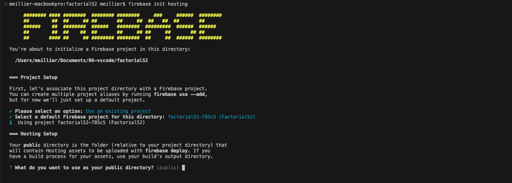
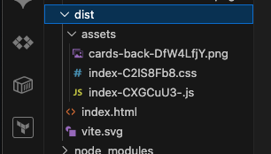
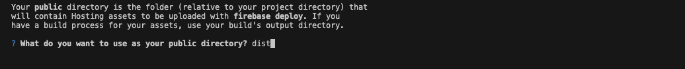

-->Y

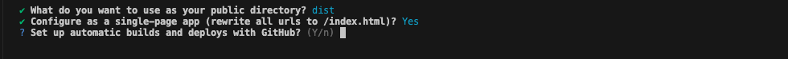
--> N

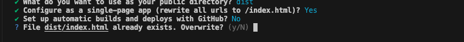
--> No


cat firebase.json
```json
{
  "hosting": {
    "public": "dist",
    "ignore": [
      "firebase.json",
      "**/.*",
      "**/node_modules/**"
    ],
    "rewrites": [
      {
        "source": "**",
        "destination": "/index.html"
      }
    ]
  }
}
```
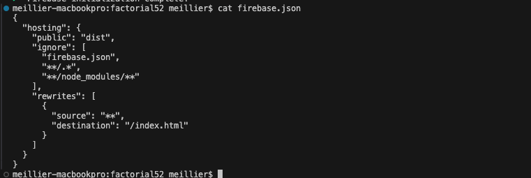

.firebaserc
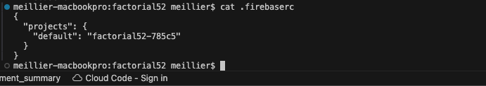
```json
{
  "projects": {
    "default": "factorial52-785c5"
  }
}
```


### Firebase deploy

```
firebase deploy
```

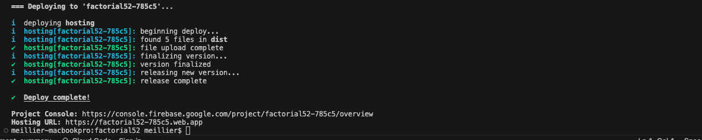


```
Project Console: https://console.firebase.google.com/project/factorial52-785c5/overview
Hosting URL: https://factorial52-785c5.web.app
```


### firebase apps:list